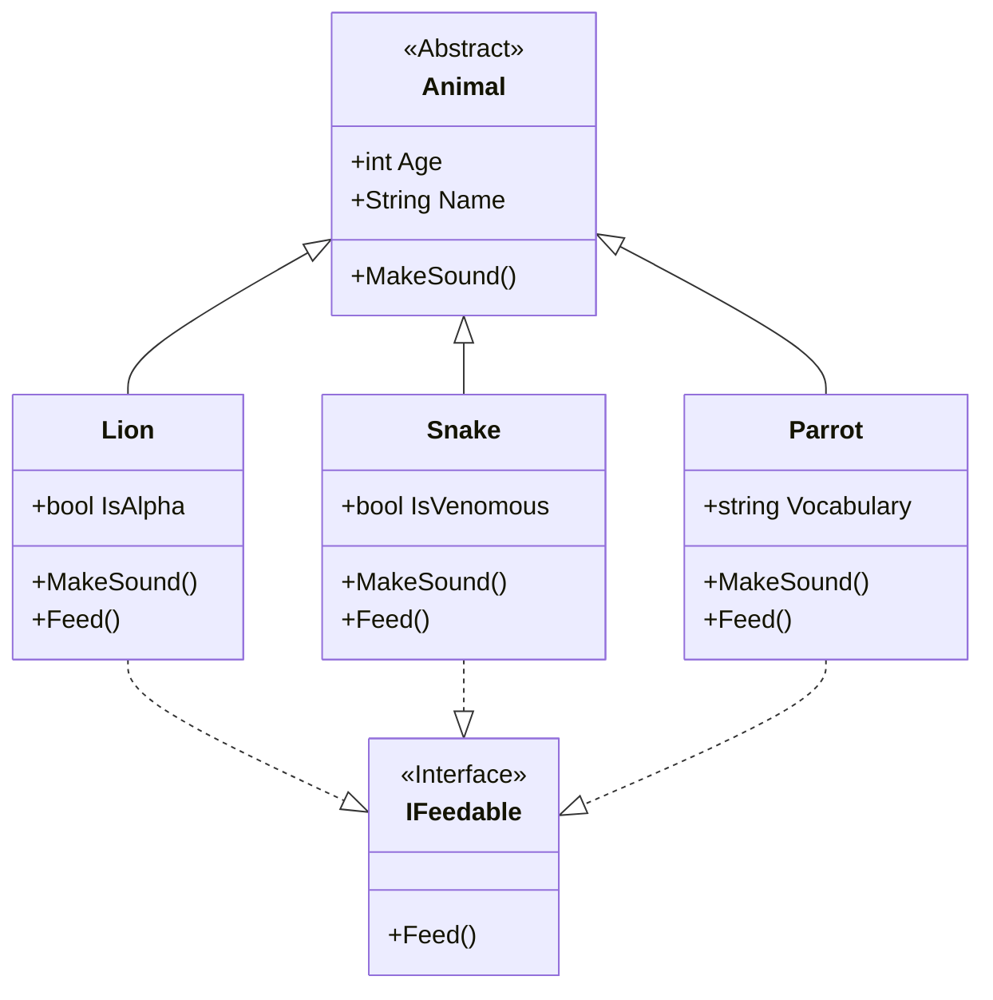

```mermaid
classDiagram
direction TB
    class Animal {
	    +int Age
	    +String Name
	    +MakeSound()
    }

    class Lion {
	    +bool IsAlpha
	    +MakeSound()
	    +Feed()
    }

    class Snake {
	    +bool IsVenomous
	    +MakeSound()
	    +Feed()
    }

    class Parrot {
	    +string Vocabulary
	    +MakeSound()
	    +Feed()
    }

    class IFeedable {
	    +Feed()
    }

	<<Abstract>> Animal
	<<Interface>> IFeedable

    Animal <|-- Lion
    Animal <|-- Parrot
    Animal <|-- Snake
    Lion ..|> IFeedable
    Snake ..|> IFeedable
    Parrot ..|> IFeedable

```
